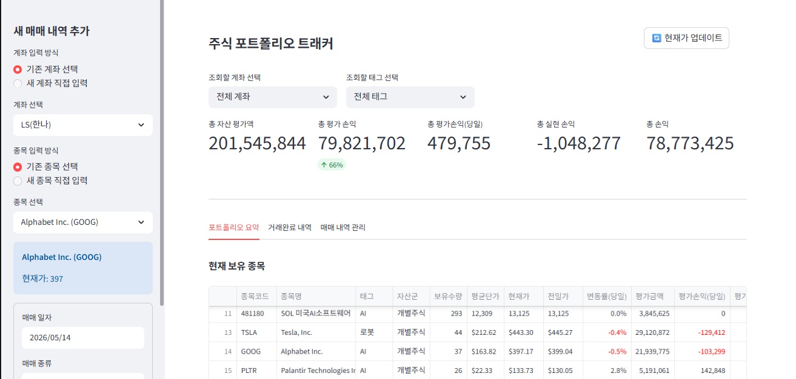
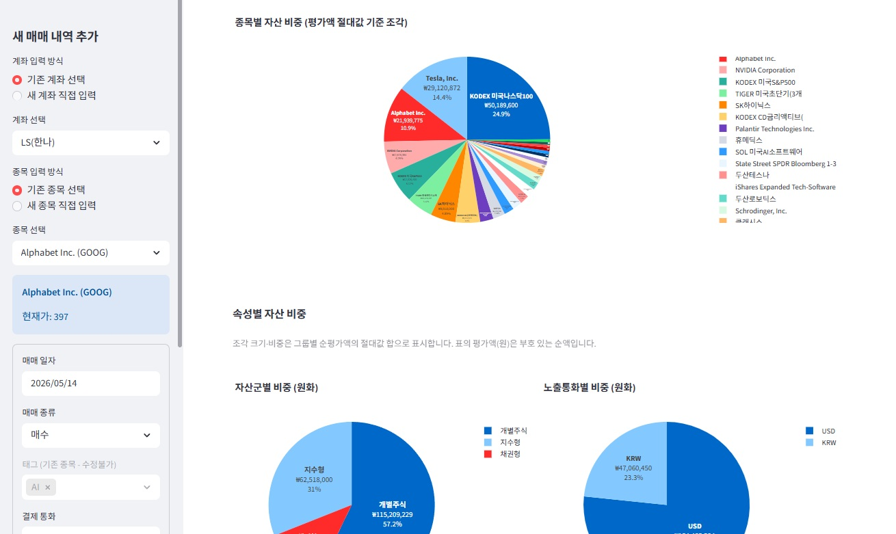

# Stock Portfolio Tracker

## 개요

주식 포트폴리오를 실시간으로 관리하고 분석하는 웹 기반 도구입니다. 현재 운영 중입니다.

**서비스 링크**: [https://stocktrader-qtpmeqpsaycuukf2fjfyxd.streamlit.app/](https://stocktrader-qtpmeqpsaycuukf2fjfyxd.streamlit.app/)

## 주요 화면

### 포트폴리오 요약

*실시간 시세 반영, 종목별 보유 현황, 평가손익, 변동률 현황*

### 자산 비중 분석

*자산군별 및 통화별 비중 분석, 포트폴리오 시각화*

---

## 주요 기능

### 실시간 시세 조회
- yfinance를 통한 실시간 주식 시세 수신
- 국내 주식: LS증권 API 연동
- 해외 주식: yfinance 직접 조회
- 환율 정보: 실시간 USD/KRW 환율 조회

### 포트폴리오 관리
- 다중 계좌 지원
- 매수/매도 내역 기록 및 수정
- 종목별 평가손익, 실현손익 계산
- 다중 통화 지원 (KRW, USD)

### 포트폴리오 분석
- 자산 비중 시각화 (파이 차트)
- 자산군별 분석 (지수형, 개별주식, 채권형, 선물)
- 노출통화별 분석 (KRW vs USD)
- 달러 노출 자산 현황

### 가격 표시
- USD 결제 자산: 소수점 둘째자리 + $ 표시
- KRW 결제 자산: 소수점 없음
- 평가손익/평가금액: 원화 기준 통합 표시

---

## 운영 현황

현재 실시간으로 운영 중입니다.

---

## 기술 스택

- **Frontend**: Streamlit
- **Backend**: Python
- **Data Source**: 
  - yfinance (해외주식, 환율)
  - LS증권 API (국내주식)
- **Data Processing**: Pandas
- **Visualization**: Plotly Express

---

## 설치 및 실행

### 요구사항
- Python 3.8+
- pip

### 의존성 설치
```bash
pip install -r requirements.txt
```

### 환경 설정
```bash
cp .envsample .env
# .env 파일에 필요한 설정 추가
```

### 로컬 실행
```bash
streamlit run app.py
```

---

## 파일 구조

```
StockTrader/
├── app.py                          # 메인 Streamlit 애플리케이션
├── requirements.txt                # Python 의존성
├── data/
│   ├── trade_history.csv          # 매매 내역 저장
│   └── product_master.json        # 종목 정보 저장
└── utils/
    ├── portfolio.py               # 포트폴리오 계산 로직
    ├── ls_t1101.py               # LS증권 국내주식 API
    ├── ls_t2101.py               # LS증권 선물 API
    └── product_master.py         # 종목 마스터 데이터 관리
```

---

## 주요 기능 설명

### 매매 내역 관리
- 신규 종목 추가: 사이드바에서 매수/매도 기록
- 매매 내역 수정/삭제: 거래 완료 탭에서 관리
- 다중 계좌 지원: 계좌별 독립적 관리

### 포트폴리오 분석
- **포트폴리오 요약**: 현재 보유 종목 현황
- **거래완료 내역**: 매도 완료된 종목의 최종 손익
- **매매 내역 관리**: 전체 거래 기록 조회 및 수정

### 통화 처리
- **단가/가격**: 원본 통화로 표시 (USD는 달러, KRW는 원화)
- **평가액/손익**: 모두 원화 기준으로 통일
- **실시간 환율**: 계산 시점의 환율 반영

---

## 데이터 출처

- **국내 주식**: LS증권 API (t1101 - 주식현재가, t2101 - 선물현재가)
- **해외 주식**: yfinance
- **환율**: yfinance (USDKRW=X)

---

## 라이선스

개인 프로젝트

---

## 문의

문제 발생 시 코드 주석 및 로그를 확인하세요.
